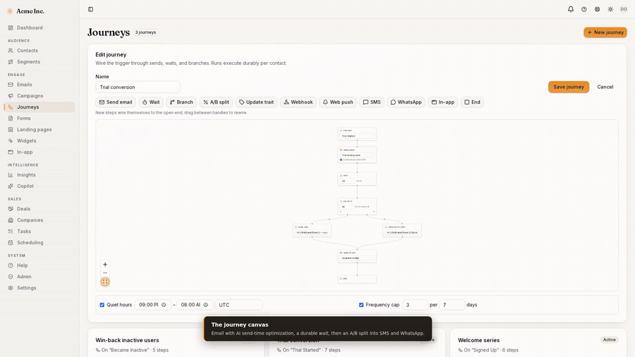
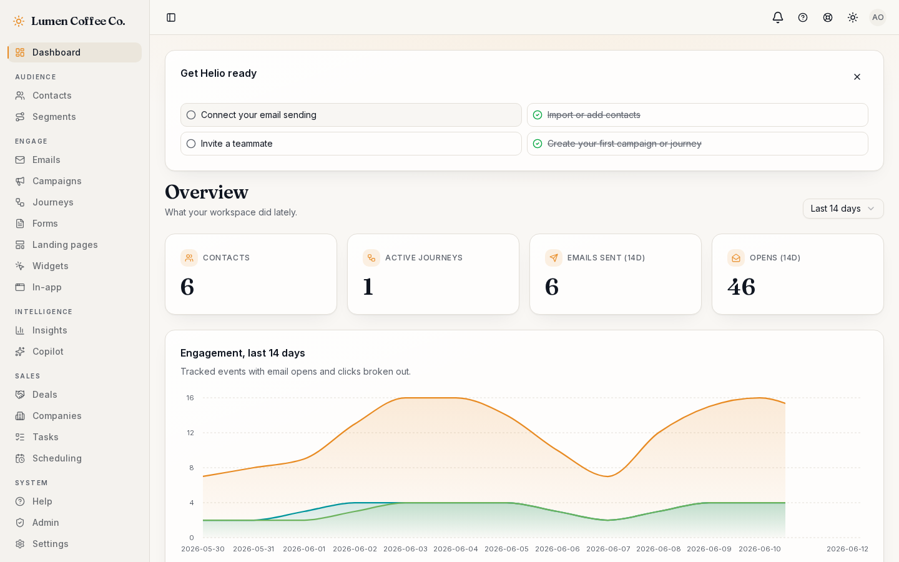
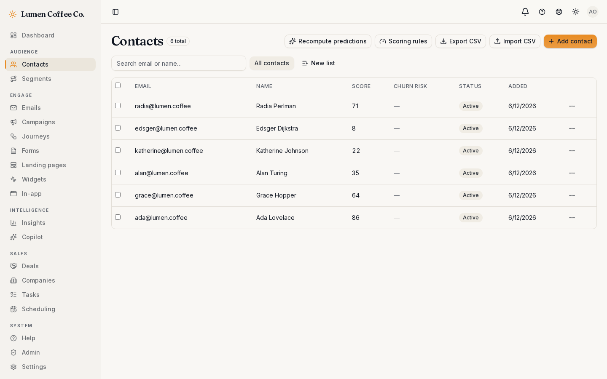
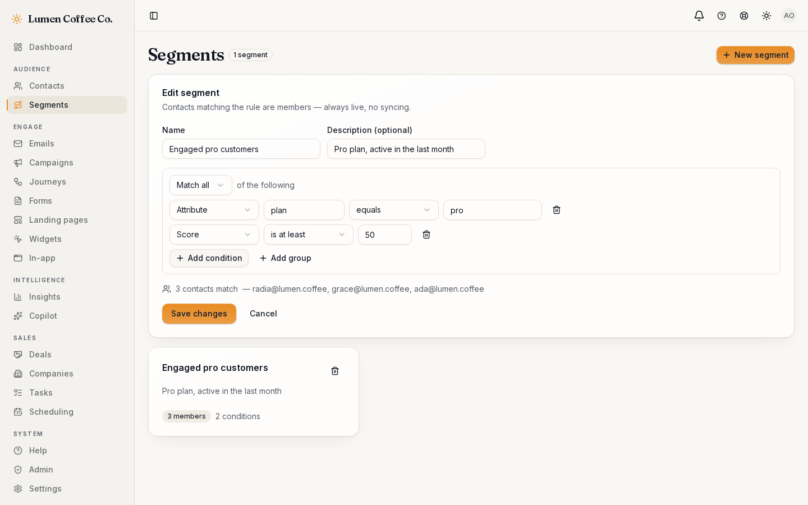
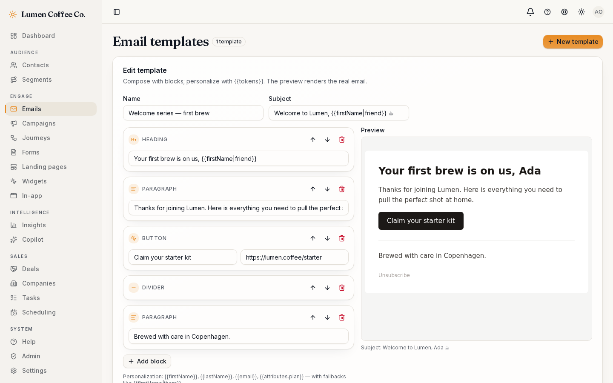
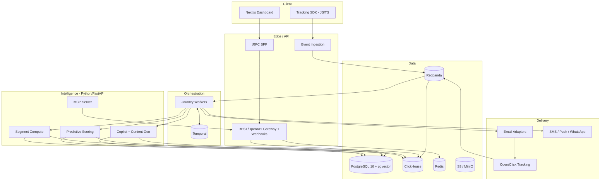

<div align="center">

# ☀️ Helio

**The open-source growth platform** — unify customer data, segment anyone, orchestrate journeys across every channel, and let AI do the heavy lifting. Self-host it, own your data, pay nothing per contact.

[](LICENSE)
[](https://github.com/achref-soua/helio/releases)
[](https://github.com/achref-soua/helio/stargazers)

</div>

> ☀️ **v2.0.0 — Helio for humans.** v1 proved the engine; v2 makes it yours without a terminal career. Install on any machine with [one command](#install-in-one-command) — the `helio` CLI drives Docker for you, the app installs to your desktop or phone (PWA), and a setup wizard takes you from blank box to working organization in minutes. Every channel sends for real, per organization: bring your own SMTP/Postmark/Resend/Mailgun, Twilio SMS, WhatsApp — and your own AI key (OpenAI, Anthropic, Groq, or a local model server), every secret sealed in an encrypted vault and shown only masked. Admins get a control room: a filterable audit trail, reports, live system health, a validated Database Studio over your own tables, and scheduled backups with one-command restore. The CRM closes the loop — contact & deal pages, companies, notes, a draggable board, sales reports — and the migration wizard pulls contacts straight from the HubSpot, Mailchimp, or Klaviyo APIs. If your data team trains its own churn model, upload it (ONNX or XGBoost; pickle refused by design) or point Helio at your model server, with automatic fallback if it ever fails. Security got the deep pass: TOTP 2FA with any authenticator app, org-enforced 2FA and password-rotation policies, scoped API keys, strict headers and rate limits everywhere. And billing is gone for good — Helio is **free forever**: no plans, no contact caps, no metering. The [roadmap](#roadmap) tells the story.

<p align="center">
  <a href="https://github.com/achref-soua/helio/releases/download/v2.0.0/helio-demo.mp4">
    
  </a>
</p>

<p align="center">
  <a href="https://github.com/achref-soua/helio/releases/download/v2.0.0/helio-demo.mp4"><b>▶&nbsp;Watch the demo film (4:27, MP4 — recorded on v2.0)</b></a>
  &nbsp;·&nbsp;
  <a href="docs/helio-product-guide.pdf"><b>📘&nbsp;Read the v2.0 product guide (PDF)</b></a>
</p>

<p align="center"><sub>The journey canvas and the AI copilot, captured from a live instance. The film and the guide regenerate from the real product via <code>task demo:video</code> and <code>task product:guide</code>.</sub></p>

## Why Helio

Marketing automation today forces a bad choice:

- **HubSpot, Customer.io, Klaviyo** — polished, but closed, expensive, and per-contact priced. Real automation sits behind ~$890+/mo tiers, and your customer data lives in someone else's cloud.
- **Mautic** — powerful but heavy (PHP/Symfony, 4–8 GB RAM) with slowing community velocity.
- **Listmonk** — delightfully fast, but newsletters only. No journeys, no automation.

**Helio takes the best of each:** Listmonk's performance, Mautic's automation depth, HubSpot's polish — open-source, self-hostable, data-sovereign, and AI-native from the first commit, not as a bolt-on.

## Features

> Legend: ✅ shipped · 🚧 in progress · 🗺️ roadmap

- ✅ **Multi-tenant platform core** — organizations & workspaces with Postgres row-level security (cross-tenant access is impossible at the database, not just filtered), role-based access (owner/admin/editor/viewer), email-verified auth with 2FA support, invitations, audit log, REST gateway with per-organization API keys, OpenAPI 3.1 + problem+json + idempotency + rate limiting
- ✅ **Contacts & lists** — profiles with free-form attributes, tolerant CSV import with validation summary, static lists, cursor-paginated search
- ✅ **Event pipeline** — zero-dependency browser SDK (`@helio/sdk-js`) → write-key-authenticated ingestion → Redpanda → ClickHouse; at-least-once with engine-level dedup. Segment/RudderStack-compatible HTTP Tracking API (`/v1/batch` + `/v1/track|identify|page`, write key via Basic auth), so existing instrumentation points straight at Helio
- ✅ **Segmentation** — visual nested AND/OR builder over fields, JSON attributes, status, and recency; always-live membership (segments are predicates, not sync jobs); NULL semantics verified against real Postgres
- ✅ **Email** — block-based template builder with a visual block palette, server-rendered live preview, image uploads from your device (stored in Helio, served from your instance) with width/alignment/rounding controls, `{{token|fallback}}` personalization, open-pixel + HMAC-signed click tracking, one-click unsubscribe (RFC 8058) + hosted preference page
- ✅ **Real sending, per organization** — connect your own SMTP relay or a native Postmark/Resend/Mailgun adapter (SES/Gmail/Brevo via their SMTP endpoints) with your own From identity; one-click verify and a live test send; Twilio SMS and WhatsApp Cloud credentials work the same way, with delivery-failure alerts in-app
- ✅ **Campaigns** — template + segment/list audiences delivered durably on Temporal: per-recipient send rows make retries double-send-proof; suppression honored at enumeration and per send
- ✅ **Journeys** — React Flow canvas → validated DAG → one Temporal workflow per enrolled contact: event triggers from the live stream, durable waits (survives `kill -9` with the timer expired), live-data branches
- ✅ **Analytics** — overview dashboard with engagement timeline and per-campaign opens/clicks from ClickHouse, degrading gracefully when the analytics stack is offline
- ✅ **Insights** — an event-stream funnel (ordered steps, conversion + drop-off via ClickHouse `windowFunnel`), a weekly cohort-retention grid, multi-touch attribution (first/last/linear credit to the campaigns that touched each converter), and a fenced read-only **SQL explorer** (single SELECT, events-table-only, auto-scoped to the workspace, row/time-capped) — with the shaping and SQL-guard logic unit-tested in `@helio/core`
- ✅ **Hosted forms** — public signup pages that upsert contacts, idempotently and suppression-safely
- ✅ **Multi-channel** — web push, SMS (Twilio), WhatsApp (Cloud API), and in-app messages as journey send nodes alongside email, personalized with the same `{{token}}` tokens
- ✅ **Deliverability** — a wizard that generates a DKIM key pair per sending domain, shows the SPF/DKIM/DMARC records to publish, and verifies them by live DNS lookup; the DKIM private key is tenant-isolated
- ✅ **Landing pages** — a block-based builder with a sticky live preview (heading, text, image, button, email-capture form; keyboard-reorderable) that publishes a white-labeled hosted page at `/p/<id>` and captures signups into the CDP
- ✅ **On-site widgets** — banners and popups composed against a live preview and shown on your own site via a one-line, zero-dependency embed (`/widget.js`) that pulls live widgets from a write-key-scoped, CORS-enabled endpoint
- ✅ **In-app messages** — per-contact messages queued by a journey's _Send in-app_ step and drained by the tracking SDK (`helio.inApp()`), resolved by the visitor's identity and scoped to the write key's workspace
- ✅ **AI copilot** — describe a segment, journey, or on-brand email in a sentence and get a working draft; predictive lead scoring & churn (with per-workspace conversion events); send-time optimization; autonomous A/B winner selection — all grounded in your own org's data
- ✅ **Bring your own AI** — each organization picks its provider (OpenAI, Anthropic, Groq, Ollama, or any OpenAI-compatible local server) and pastes its own key in Settings; keys are sealed with AES-256-GCM, shown only masked, and never logged
- ✅ **Bring your own churn model** — upload an ONNX or XGBoost model (pickle refused by design) or connect your own model server; the feature mapping is automatic (train on the one-click CSV and it plugs straight in); validated in a locked-down sandbox, one click to activate, automatic fallback to the built-in model if yours ever fails — plus a one-click training-data CSV
- ✅ **Agent-ready** — an MCP server exposes Helio's capabilities as tools, so external AI agents can drive campaigns programmatically
- ✅ **CRM-lite** — pipelines with configurable stages and a deal board, a task list (calls, emails, meetings, to-dos) grouped by due date, and a meeting scheduler with public booking pages (timezone-correct slots, server-validated, double-book-proof) that file meetings into the CRM; all tenant-isolated
- ✅ **Migration & ingestion** — one-click importers that detect HubSpot/Mailchimp/Klaviyo exports (mapping who's unsubscribed), and a Segment/RudderStack-compatible HTTP Tracking API so existing instrumentation points straight at Helio
- ✅ **One-minute first run** — a fresh install opens on a setup screen (admin, organization, workspace — done); instances are invite-only after that, and Helio installs as its own desktop/mobile app (PWA) with a getting-started checklist on the dashboard
- ✅ **Free forever** — no plans, no contact caps, no metering, no payment integrations; every Helio deployment is unlimited
- ✅ **Credential vault** — every third-party secret (email/SMS/WhatsApp/AI keys, signing secrets, DKIM keys) is encrypted at rest with a deployment key, bound to its row so ciphertext can't be replayed elsewhere, with zero-downtime key rotation
- ✅ **Enterprise SSO & SCIM** — per-organization OIDC single sign-on (domain-routed, server-authoritative org binding) and SCIM 2.0 user provisioning; IdP client secrets and SCIM tokens are walled off from the tenant database role
- ✅ **SDKs & docs** — typed REST SDKs for JavaScript/TypeScript and Python, generated from the OpenAPI spec, plus a full documentation site (Fumadocs)
- ✅ **Outbound webhooks** — subscribe endpoints to lifecycle events (contacts, deals, tasks); each delivery is HMAC-signed with the endpoint's own secret over a timestamped scheme and sent on a durable, retrying workflow, with a one-click test ping
- ✅ **White-labeling** — per-organization display name, accent color, and logo applied across the dashboard shell and hosted pages; the accent drives the primary token with an auto-picked legible foreground, validated hex-only so it can't inject markup
- ✅ **In-app support** — a report-a-bug / feedback widget in every page header (captures the current route for context) and an admin support inbox to triage and resolve; tenant-isolated
- ✅ **Onboarding tour** — a dependency-free product tour that greets new operators and points them at contacts, journeys, the AI copilot, and the CRM; shown once, dismissible
- ✅ **Shopify** — connect a store and stream `customers/create|update` and `orders/create` into the CDP; every webhook is HMAC-verified, the shop domain resolves the org, and buyers gain `shopify_*` traits you can segment on
- ✅ **Salesforce** — connect an org and new Helio contacts push to Salesforce as Leads via the REST API; best-effort so a Salesforce hiccup never blocks the contact write
- 🗺️ **Platform integrations** — ad-audience sync

### The product in action

|                                                                           |                                                                              |
| ------------------------------------------------------------------------- | ---------------------------------------------------------------------------- |
|  |      |
|      |  |

## Architecture



TypeScript owns the product surface (dashboard, APIs, journey workers on Temporal for durable execution); Python owns the intelligence plane (scoring, content generation, segment compute, MCP). PostgreSQL holds transactional state with row-level security per tenant; ClickHouse holds the event firehose for analytics; Redpanda is the backbone between them.

## Install in one command

One-time prerequisite: Docker — a normal, free app install ([Desktop](https://docs.docker.com/desktop/) on Windows/macOS, [Engine](https://docs.docker.com/engine/install/) on servers). On Windows the installer below even offers to set it up for you. Helio handles absolutely everything else.

**Linux / macOS / servers & VMs**

```bash
curl -fsSL https://github.com/achref-soua/helio/releases/latest/download/install.sh | sh
```

**Windows (PowerShell)**

```powershell
irm https://github.com/achref-soua/helio/releases/latest/download/install.ps1 | iex
```

The installer downloads the `helio` CLI for your machine, checks Docker, generates this installation's secrets, pulls release-pinned images, runs migrations, starts the stack, and opens the dashboard — create the first account there and it becomes the administrator. Day 2 is just as boring: `helio status`, `helio logs`, `helio backup`, `helio update` (which takes a safety backup first), `helio doctor` when something looks off. Leaving is one command too: `helio uninstall` stops and removes the stack but keeps your data; `helio uninstall --purge-data` erases everything (both ask you to type `uninstall` first).

Everything lives under `~/.helio` (compose file, `.env` with your secrets, backups). The default **core** profile (~2.5 GB RAM) runs the dashboard, REST API, and AI service; `helio up --full` adds campaign sending, event ingestion, tracking, and analytics for bigger hosts. Mail goes to the bundled [Mailpit](https://mailpit.axllent.org/) test inbox until an organization connects its real provider under **Settings → Provider credentials** — so you can explore without sending anyone anything.

## Develop from source

```bash
git clone https://github.com/achref-soua/helio.git
cd helio
cp .env.example .env       # set BETTER_AUTH_SECRET (openssl rand -hex 32) + HELIO_ENCRYPTION_KEY (openssl rand -base64 32)
task setup                 # install dependencies + git hooks
task up                    # Postgres (+pgvector), Redis, Mailpit
task db:migrate && task db:seed
pnpm --filter @helio/web dev
```

Open `http://localhost:3000`, sign up, and verify your email at Mailpit (`http://localhost:8025`) — onboarding creates your organization, and the seed provisions a ready-to-explore demo workspace: contacts (with lead scores and AI predictions), lists, segments, email templates, a campaign, an active welcome journey, lead-scoring rules, a CRM pipeline with deals and tasks, and a demo write key. Dev email never leaves your machine.

**Want the full loop (campaigns, journeys, event analytics)?**

```bash
task up:full               # adds ClickHouse, Redpanda, Temporal, MinIO
pnpm --filter @helio/ingest dev      # event ingestion :4100
pnpm --filter @helio/tracking dev    # open/click tracking :4200
pnpm --filter @helio/workers dev     # Temporal worker (sends + journeys)
```

Create a template under **Emails**, a campaign under **Campaigns**, hit Send — mail lands in Mailpit with live tracking links, and opens/clicks stream into the dashboard. Fire `curl -X POST localhost:4100/v1/batch -H 'x-write-key: wk_demo_0000000000000000000000000' -H 'content-type: application/json' -d '{"batch":[{"type":"track","event":"Signed Up","userId":"ada@example.com"}]}'` to enroll a contact into an active journey.

### Everything you can run

| Command                                                                          | What it does                                                                                 |
| -------------------------------------------------------------------------------- | -------------------------------------------------------------------------------------------- |
| `task up` / `task up:full` / `task up:observability`                             | core infra / + ClickHouse, Redpanda, Temporal, MinIO / + Prometheus, Grafana, OTel collector |
| `task db:migrate` · `db:seed` · `db:studio` · `db:reset`                         | schema & data lifecycle                                                                      |
| `task lint` · `typecheck` · `test` · `format` · `build`                          | the quality pipeline (same as CI)                                                            |
| `pnpm --filter @helio/web dev` / `@helio/api dev`                                | dashboard :3000 / gateway :4000                                                              |
| `pnpm --filter @helio/ingest dev` / `@helio/tracking dev` / `@helio/workers dev` | ingestion :4100 / tracking :4200 / Temporal worker                                           |
| `task ch:migrate`                                                                | apply ClickHouse migrations standalone (the ingest service also applies them at boot)        |
| `cd apps/intelligence && uv run uvicorn helio_intelligence.app:app --reload`     | intelligence :8000                                                                           |
| `cd apps/web && pnpm test:e2e`                                                   | Playwright suite incl. the full signup→invite→accept journey                                 |
| `task screenshots`                                                               | regenerate `docs/assets` from a running app                                                  |

Details: [local-dev runbook](docs/runbooks/local-dev.md).

## Configuration

Every environment variable any service reads is documented in [`.env.example`](.env.example), added in the same PR as the feature that reads it. Required variables fail fast at startup.

## Deployment

Multi-stage, non-root, healthchecked images for every service live in [`infra/docker/`](infra/docker) and publish to GHCR on every `main` push (Trivy-gated, SBOM attached):

```bash
for service in web api ingest tracking workers intelligence; do
  docker build -f "infra/docker/$service.Dockerfile" -t "helio-$service" .
done
```

Compose profiles cover local/self-host topologies. For Kubernetes, a Helm chart lives in [`infra/helm/helio`](infra/helm/helio) — `helm install helio ./infra/helm/helio` brings up all six services with health probes, optional Ingress and autoscaling, and (for evaluation) bundled Postgres + Redis; point it at managed datastores for production. The managed-cloud walkthrough lives in [`apps/docs/content/docs/production.mdx`](apps/docs/content/docs/production.mdx).

## Performance

Measured on the development reference (WSL2, core profile, production build, v2.0 tree): warm server-rendered responses for the dashboard's key routes land at **24–44 ms** (`/contacts` 24 ms, `/deals` 28 ms, `/admin/audit` 30 ms, `/settings` 36 ms; first-hit ≤ 530 ms including route compilation warm-up). The journey canvas (React Flow) is code-split and loads only when an editor opens. Journey sends run on Temporal with explicit retry policies (5 attempts on sends, 3 on short activities) and raise in-app system alerts on exhaustion.

Hot-path budgets (ingestion ≥ 5k events/s, API reads p95 < 150 ms) have a committed k6 harness in [`infra/k6/`](infra/k6) — `task loadtest` drives a 6 000 events/s firehose at the ingestion endpoint with thresholds asserted. Run it against the full stack and record the summary in [`infra/k6/README.md`](infra/k6/README.md).

## Roadmap

| Milestone | Focus                                                                                                                                                                                                                                                                                                                                                                                                                                                                                                                                                                                   |
| --------- | --------------------------------------------------------------------------------------------------------------------------------------------------------------------------------------------------------------------------------------------------------------------------------------------------------------------------------------------------------------------------------------------------------------------------------------------------------------------------------------------------------------------------------------------------------------------------------------- |
| **v0.1**  | Foundation: monorepo, CI/CD, multi-tenant auth & RBAC, design system, observability baseline                                                                                                                                                                                                                                                                                                                                                                                                                                                                                            |
| **v0.2**  | Usable MVP: contacts & lists, event ingestion, segmentation, email sending & tracking, first journeys                                                                                                                                                                                                                                                                                                                                                                                                                                                                                   |
| **v0.3**  | Growth: full journey canvas, SMS & push, landing pages, lead scoring, A/B testing, attribution                                                                                                                                                                                                                                                                                                                                                                                                                                                                                          |
| **v0.4**  | AI: copilot, NL→segment, NL→journey, brand-voice generation, MCP server                                                                                                                                                                                                                                                                                                                                                                                                                                                                                                                 |
| **v0.5**  | AI, cont'd: predictive scoring & churn, send-time optimization, autonomous A/B winner selection                                                                                                                                                                                                                                                                                                                                                                                                                                                                                         |
| **v0.6**  | Platform: HubSpot/Mailchimp/Klaviyo importers, Segment-compatible ingestion, CRM-lite deal board                                                                                                                                                                                                                                                                                                                                                                                                                                                                                        |
| **v0.7**  | Platform: opt-in Stripe billing with plan-gated usage limits and a signature-verified webhook                                                                                                                                                                                                                                                                                                                                                                                                                                                                                           |
| **v0.8**  | Platform: enterprise SSO & SCIM, generated REST SDKs (JS + Python), documentation site, richer demo seed                                                                                                                                                                                                                                                                                                                                                                                                                                                                                |
| **v0.9**  | Platform: Kubernetes Helm chart, and production & managed-cloud deployment guides                                                                                                                                                                                                                                                                                                                                                                                                                                                                                                       |
| **v0.10** | Platform: CRM tasks & meeting scheduler, outbound webhooks, white-labeling, Shopify & Salesforce                                                                                                                                                                                                                                                                                                                                                                                                                                                                                        |
| **v1.0**  | Launch: published load-test numbers (run the shipped k6 harness on reference hardware) and a hosted public demo (stand it up with the shipped Helm/Compose), then tag v1.0.0                                                                                                                                                                                                                                                                                                                                                                                                            |
| **v2.0**  | Helio for humans: one-command install (`helio` CLI + PWA) with a setup wizard, per-org real sending (SMTP/Postmark/Resend/Mailgun, Twilio, WhatsApp) and BYO AI key behind an encrypted credential vault, admin control room (audit, reports, system health, Database Studio, backups & restore), complete CRM (contact/deal pages, companies, board, sales reports), API-driven migration wizard, BYO churn model (ONNX/XGBoost/HTTPS), the security deep pass (org 2FA & password-rotation policies, scoped API keys), mobile/responsive overhaul — and billing removed: free forever |

## Documentation

- 📘 **[Product guide (PDF)](docs/helio-product-guide.pdf)** — the whole story in 23 pages: why Helio, a screenshot tour, installation and org setup, migrating from HubSpot/Mailchimp/Klaviyo, the CRM, the admin control room, the usage guide, and how to contribute. Written for technical and non-technical readers alike.
- 🧭 **[Setup guide (PDF)](docs/helio-setup-guide.pdf)** — a plain-language walkthrough for operators: install Helio, complete first-run setup, and understand every settings panel. No technical background needed.
- 📖 **[Documentation site](apps/docs)** (Fumadocs) — concepts, self-hosting, configuration, every feature guide, the REST API, SDKs, the MCP server, and migration guides. Run it locally with `task docs` (→ `localhost:3002`).
- [Architecture (C4) & trust boundaries](docs/architecture.md) · [Decision log (ADRs)](docs/adr) · [Threat model](docs/threat-model.md)
- [Local-dev runbook](docs/runbooks/local-dev.md) · [SSO & SCIM setup](docs/sso.md) · [REST API guide](docs/api.md) · [API spec (OpenAPI 3.1)](apps/api/openapi.json)

## Contributing & policies

- [CONTRIBUTING.md](CONTRIBUTING.md) — dev setup, branching model, commit conventions, PR rules
- [SECURITY.md](SECURITY.md) — how to report vulnerabilities (privately, please)
- [Privacy Policy](apps/docs/content/docs/legal/privacy.mdx) — the project collects nothing; here is exactly what that means
- [Terms of Use](apps/docs/content/docs/legal/terms.mdx) — AGPL-3.0 is the contract; plain-words expectations around it
- [Data & Compliance](apps/docs/content/docs/legal/data-and-compliance.mdx) — where deployment data lives, the GDPR/email tooling, and the operator checklist
- [Marketing kit](docs/marketing/) — launch article, social post, and a discoverability checklist

## License

[AGPL-3.0](LICENSE) — free to self-host, modify, and redistribute; network-service modifications must stay open.
