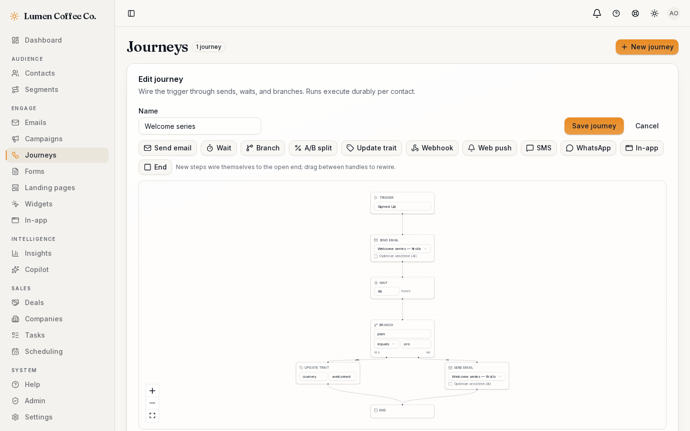
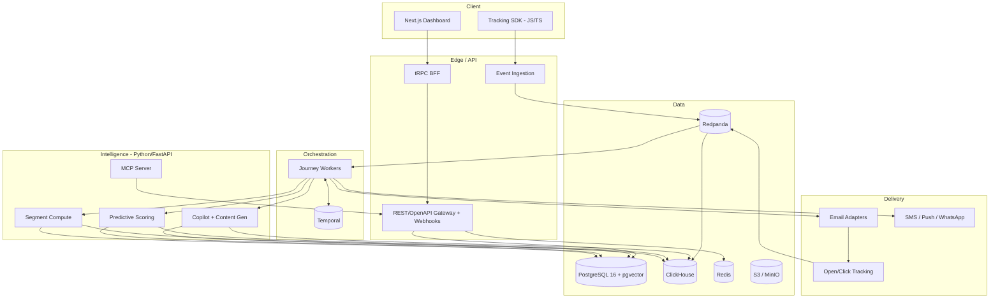

<div align="center">

# ☀️ Helio

**The open-source growth platform** — unify customer data, segment anyone, orchestrate journeys across every channel, and let AI do the heavy lifting. Self-host it, own your data, pay nothing per contact.

[](https://github.com/achref-soua/helio/actions/workflows/ci.yml)
[](LICENSE)
[](https://github.com/achref-soua/helio/releases)
[](https://github.com/achref-soua/helio/stargazers)

</div>

> 🚧 **Status: usable MVP (v0.2).** The end-to-end loop works today: import contacts → build a segment → design an email → launch a campaign or an event-triggered journey → watch opens and clicks land in the dashboard. Journeys run on Temporal and survive `kill -9` mid-wait without double-sending. The [roadmap](#roadmap) tracks what's next.

<p align="center">
  
</p>

<p align="center"><sub>The journey canvas — every run executes durably on Temporal and survives worker crashes mid-wait. All screenshots regenerate from a live app via <code>task screenshots</code>.</sub></p>

## Why Helio

Marketing automation today forces a bad choice:

- **HubSpot, Customer.io, Klaviyo** — polished, but closed, expensive, and per-contact priced. Real automation sits behind ~$890+/mo tiers, and your customer data lives in someone else's cloud.
- **Mautic** — powerful but heavy (PHP/Symfony, 4–8 GB RAM) with slowing community velocity.
- **Listmonk** — delightfully fast, but newsletters only. No journeys, no automation.

**Helio takes the best of each:** Listmonk's performance, Mautic's automation depth, HubSpot's polish — open-source, self-hostable, data-sovereign, and AI-native from the first commit, not as a bolt-on.

## Features

> Legend: ✅ shipped · 🚧 in progress · 🗺️ roadmap

- ✅ **Multi-tenant platform core** — organizations & workspaces with Postgres row-level security (cross-tenant access is impossible at the database, not just filtered), role-based access (owner/admin/editor/viewer), email-verified auth with 2FA support, invitations, audit log, REST gateway with OpenAPI 3.1 + problem+json + idempotency + rate limiting
- ✅ **Contacts & lists** — profiles with free-form attributes, tolerant CSV import with validation summary, static lists, cursor-paginated search
- ✅ **Event pipeline** — zero-dependency browser SDK (`@helio/sdk-js`) → write-key-authenticated ingestion → Redpanda → ClickHouse; at-least-once with engine-level dedup
- ✅ **Segmentation** — visual nested AND/OR builder over fields, JSON attributes, status, and recency; always-live membership (segments are predicates, not sync jobs); NULL semantics verified against real Postgres
- ✅ **Email** — block-based template builder with server-rendered live preview, `{{token|fallback}}` personalization, open-pixel + HMAC-signed click tracking, one-click unsubscribe (RFC 8058) + hosted preference page
- ✅ **Campaigns** — template + segment/list audiences delivered durably on Temporal: per-recipient send rows make retries double-send-proof; suppression honored at enumeration and per send
- ✅ **Journeys** — React Flow canvas → validated DAG → one Temporal workflow per enrolled contact: event triggers from the live stream, durable waits (survives `kill -9` with the timer expired), live-data branches
- ✅ **Analytics** — overview dashboard with engagement timeline and per-campaign opens/clicks from ClickHouse, degrading gracefully when the analytics stack is offline
- ✅ **Hosted forms** — public signup pages that upsert contacts, idempotently and suppression-safely
- 🗺️ **Multi-channel** — SMS, WhatsApp, web push, in-app messages, popups
- 🗺️ **Growth tooling** — landing-page builder, lead scoring, A/B testing, attribution, deliverability wizard
- 🗺️ **AI copilot** — describe a journey in a sentence and get a working automation; brand-voice content generation; predictive scoring & churn; send-time optimization
- 🗺️ **Agent-ready** — an MCP server exposes Helio's capabilities as tools, so external AI agents can drive campaigns programmatically
- 🗺️ **Integrations** — webhooks, SDKs generated from the OpenAPI spec, importers from HubSpot/Mailchimp/Klaviyo

### The product in action

|                                                                           |                                                                              |
| ------------------------------------------------------------------------- | ---------------------------------------------------------------------------- |
|  |      |
|      |  |

## Architecture



TypeScript owns the product surface (dashboard, APIs, journey workers on Temporal for durable execution); Python owns the intelligence plane (scoring, content generation, segment compute, MCP). PostgreSQL holds transactional state with row-level security per tenant; ClickHouse holds the event firehose for analytics; Redpanda is the backbone between them.

## Quickstart

```bash
git clone https://github.com/achref-soua/helio.git
cd helio
cp .env.example .env       # set BETTER_AUTH_SECRET + API_BOOTSTRAP_TOKEN (openssl rand -hex 32)
task setup                 # install dependencies + git hooks
task up                    # Postgres (+pgvector), Redis, Mailpit
task db:migrate && task db:seed
pnpm --filter @helio/web dev
```

Open `http://localhost:3000`, sign up, and verify your email at Mailpit (`http://localhost:8025`) — onboarding creates your organization, and the seed provisions a demo workspace with contacts, a list, and a write key. Dev email never leaves your machine.

**Want the full loop (campaigns, journeys, event analytics)?**

```bash
task up:full               # adds ClickHouse, Redpanda, Temporal, MinIO
pnpm --filter @helio/ingest dev      # event ingestion :4100
pnpm --filter @helio/tracking dev    # open/click tracking :4200
pnpm --filter @helio/workers dev     # Temporal worker (sends + journeys)
```

Create a template under **Emails**, a campaign under **Campaigns**, hit Send — mail lands in Mailpit with live tracking links, and opens/clicks stream into the dashboard. Fire `curl -X POST localhost:4100/v1/batch -H 'x-write-key: wk_demo_0000000000000000000000000' -H 'content-type: application/json' -d '{"batch":[{"type":"track","event":"Signed Up","userId":"ada@example.com"}]}'` to enroll a contact into an active journey.

### Everything you can run

| Command                                                                          | What it does                                                                                 |
| -------------------------------------------------------------------------------- | -------------------------------------------------------------------------------------------- |
| `task up` / `task up:full` / `task up:observability`                             | core infra / + ClickHouse, Redpanda, Temporal, MinIO / + Prometheus, Grafana, OTel collector |
| `task db:migrate` · `db:seed` · `db:studio` · `db:reset`                         | schema & data lifecycle                                                                      |
| `task lint` · `typecheck` · `test` · `format` · `build`                          | the quality pipeline (same as CI)                                                            |
| `pnpm --filter @helio/web dev` / `@helio/api dev`                                | dashboard :3000 / gateway :4000                                                              |
| `pnpm --filter @helio/ingest dev` / `@helio/tracking dev` / `@helio/workers dev` | ingestion :4100 / tracking :4200 / Temporal worker                                           |
| `task ch:migrate`                                                                | apply ClickHouse migrations standalone (the ingest service also applies them at boot)        |
| `cd apps/intelligence && uv run uvicorn helio_intelligence.app:app --reload`     | intelligence :8000                                                                           |
| `cd apps/web && pnpm test:e2e`                                                   | Playwright suite incl. the full signup→invite→accept journey                                 |
| `task screenshots`                                                               | regenerate `docs/assets` from a running app                                                  |

Details: [local-dev runbook](docs/runbooks/local-dev.md).

## Configuration

Every environment variable any service reads is documented in [`.env.example`](.env.example), added in the same PR as the feature that reads it. Required variables fail fast at startup.

## Deployment

Multi-stage, non-root, healthchecked images for every service live in [`infra/docker/`](infra/docker) and publish to GHCR on every `main` push (Trivy-gated, SBOM attached):

```bash
for service in web api ingest tracking workers intelligence; do
  docker build -f "infra/docker/$service.Dockerfile" -t "helio-$service" .
done
```

Compose profiles cover local/self-host topologies; the Helm chart and managed-cloud walkthrough ship with the v1 platform milestone.

## Performance

Hot-path budgets (ingestion ≥ 5k events/s, API reads p95 < 150 ms) have a committed k6 harness in [`infra/k6/`](infra/k6) — `task loadtest` drives a 6 000 events/s firehose at the ingestion endpoint with thresholds asserted. Run it against the full stack and record the summary in [`infra/k6/README.md`](infra/k6/README.md).

## Roadmap

| Milestone | Focus                                                                                                 |
| --------- | ----------------------------------------------------------------------------------------------------- |
| **v0.1**  | Foundation: monorepo, CI/CD, multi-tenant auth & RBAC, design system, observability baseline          |
| **v0.2**  | Usable MVP: contacts & lists, event ingestion, segmentation, email sending & tracking, first journeys |
| **v0.3**  | Growth: full journey canvas, SMS & push, landing pages, lead scoring, A/B testing, attribution        |
| **v0.4**  | AI: copilot, NL→segment, NL→journey, brand-voice generation, predictive scoring, MCP server           |
| **v1.0**  | Platform: integrations, importers, SSO/SCIM, billing, CRM-lite, docs site, public demo                |

## Documentation

- [Architecture (C4) & trust boundaries](docs/architecture.md) · [Decision log (ADRs)](docs/adr) · [Threat model](docs/threat-model.md)
- [Local-dev runbook](docs/runbooks/local-dev.md) · [API spec (OpenAPI 3.1)](apps/api/openapi.json)

## Contributing & policies

- [CONTRIBUTING.md](CONTRIBUTING.md) — dev setup, branching model, commit conventions, PR rules
- [SECURITY.md](SECURITY.md) — how to report vulnerabilities (privately, please)

## License

[AGPL-3.0](LICENSE) — free to self-host, modify, and redistribute; network-service modifications must stay open.
