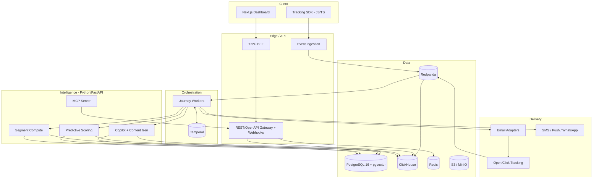

<div align="center">

# ☀️ Helio

**The open-source growth platform** — unify customer data, segment anyone, orchestrate journeys across every channel, and let AI do the heavy lifting. Self-host it, own your data, pay nothing per contact.

[](https://github.com/achref-soua/helio/actions/workflows/ci.yml)
[](LICENSE)
[](https://github.com/achref-soua/helio/releases)
[](https://github.com/achref-soua/helio/stargazers)

</div>

> 🚧 **Status: Foundation phase (pre-v0.1).** Helio is under heavy initial development. The architecture below is the build target; the [roadmap](#roadmap) tracks what's shipped. Star the repo to follow along.

<!-- hero screenshot + journey-builder GIF land here, generated by `task screenshots` into docs/assets/ -->

## Why Helio

Marketing automation today forces a bad choice:

- **HubSpot, Customer.io, Klaviyo** — polished, but closed, expensive, and per-contact priced. Real automation sits behind ~$890+/mo tiers, and your customer data lives in someone else's cloud.
- **Mautic** — powerful but heavy (PHP/Symfony, 4–8 GB RAM) with slowing community velocity.
- **Listmonk** — delightfully fast, but newsletters only. No journeys, no automation.

**Helio takes the best of each:** Listmonk's performance, Mautic's automation depth, HubSpot's polish — open-source, self-hostable, data-sovereign, and AI-native from the first commit, not as a bolt-on.

## Features

> Legend: ✅ shipped · 🚧 in progress · 🗺️ roadmap

- ✅ **Multi-tenant platform core** — organizations & workspaces with Postgres row-level security (cross-tenant access is impossible at the database, not just filtered), role-based access (owner/admin/editor/viewer), email-verified auth with 2FA support, invitations, audit log, REST gateway with OpenAPI 3.1 + problem+json + idempotency + rate limiting
- 🚧 **Customer data platform** — unified profiles, custom traits, identity resolution, full event timelines, GDPR export/delete
- 🗺️ **Segmentation** — visual nested AND/OR builder, behavioral segments, RFM, suppression lists, natural-language → segment
- 🗺️ **Journeys** — visual canvas executing on a durable workflow engine: journeys survive restarts and multi-week waits with no double-sends
- 🗺️ **Email** — drag-and-drop builder, personalization, A/B testing, open/click tracking, one-click unsubscribe + preference center, deliverability wizard
- 🗺️ **Multi-channel** — SMS, WhatsApp, web push, in-app messages, on-site forms & popups
- 🗺️ **Analytics & attribution** — funnels, cohorts, revenue attribution, deliverability analytics, real-time dashboards
- 🗺️ **AI copilot** — describe a journey in a sentence and get a working automation; brand-voice content generation; predictive scoring & churn; send-time optimization
- 🗺️ **Agent-ready** — an MCP server exposes Helio's capabilities as tools, so external AI agents can drive campaigns programmatically
- 🗺️ **Integrations** — webhooks, SDKs generated from the OpenAPI spec, importers from HubSpot/Mailchimp/Klaviyo

## Architecture



TypeScript owns the product surface (dashboard, APIs, journey workers on Temporal for durable execution); Python owns the intelligence plane (scoring, content generation, segment compute, MCP). PostgreSQL holds transactional state with row-level security per tenant; ClickHouse holds the event firehose for analytics; Redpanda is the backbone between them.

## Quickstart

```bash
git clone https://github.com/achref-soua/helio.git
cd helio
cp .env.example .env       # set BETTER_AUTH_SECRET + API_BOOTSTRAP_TOKEN (openssl rand -hex 32)
task setup                 # install dependencies + git hooks
task up                    # Postgres (+pgvector), Redis, Mailpit
task db:migrate && task db:seed
pnpm --filter @helio/web dev
```

Open `http://localhost:3000`, sign up, and verify your email at Mailpit (`http://localhost:8025`) — onboarding creates your organization. Dev email never leaves your machine.

### Everything you can run

| Command                                                                      | What it does                                                                                 |
| ---------------------------------------------------------------------------- | -------------------------------------------------------------------------------------------- |
| `task up` / `task up:full` / `task up:observability`                         | core infra / + ClickHouse, Redpanda, Temporal, MinIO / + Prometheus, Grafana, OTel collector |
| `task db:migrate` · `db:seed` · `db:studio` · `db:reset`                     | schema & data lifecycle                                                                      |
| `task lint` · `typecheck` · `test` · `format` · `build`                      | the quality pipeline (same as CI)                                                            |
| `pnpm --filter @helio/web dev` / `@helio/api dev`                            | dashboard :3000 / gateway :4000                                                              |
| `cd apps/intelligence && uv run uvicorn helio_intelligence.app:app --reload` | intelligence :8000                                                                           |
| `cd apps/web && pnpm test:e2e`                                               | Playwright suite incl. the full signup→invite→accept journey                                 |
| `task screenshots`                                                           | regenerate `docs/assets` from a running app                                                  |

Details: [local-dev runbook](docs/runbooks/local-dev.md).

## Configuration

Every environment variable any service reads is documented in [`.env.example`](.env.example), added in the same PR as the feature that reads it. Required variables fail fast at startup.

## Deployment

Multi-stage, non-root, healthchecked images for all three services live in [`infra/docker/`](infra/docker) and publish to GHCR on every `main` push (Trivy-gated, SBOM attached):

```bash
docker build -f infra/docker/web.Dockerfile -t helio-web .
docker build -f infra/docker/api.Dockerfile -t helio-api .
docker build -f infra/docker/intelligence.Dockerfile -t helio-intelligence .
```

Compose profiles cover local/self-host topologies; the Helm chart and managed-cloud walkthrough ship with the v1 platform milestone.

## Roadmap

| Milestone | Focus                                                                                                 |
| --------- | ----------------------------------------------------------------------------------------------------- |
| **v0.1**  | Foundation: monorepo, CI/CD, multi-tenant auth & RBAC, design system, observability baseline          |
| **v0.2**  | Usable MVP: contacts & lists, event ingestion, segmentation, email sending & tracking, first journeys |
| **v0.3**  | Growth: full journey canvas, SMS & push, landing pages, lead scoring, A/B testing, attribution        |
| **v0.4**  | AI: copilot, NL→segment, NL→journey, brand-voice generation, predictive scoring, MCP server           |
| **v1.0**  | Platform: integrations, importers, SSO/SCIM, billing, CRM-lite, docs site, public demo                |

## Documentation

- [Architecture (C4) & trust boundaries](docs/architecture.md) · [Decision log (ADRs)](docs/adr) · [Threat model](docs/threat-model.md)
- [Local-dev runbook](docs/runbooks/local-dev.md) · [API spec (OpenAPI 3.1)](apps/api/openapi.json)

## Contributing & policies

- [CONTRIBUTING.md](CONTRIBUTING.md) — dev setup, branching model, commit conventions, PR rules
- [SECURITY.md](SECURITY.md) — how to report vulnerabilities (privately, please)

## License

[AGPL-3.0](LICENSE) — free to self-host, modify, and redistribute; network-service modifications must stay open.
