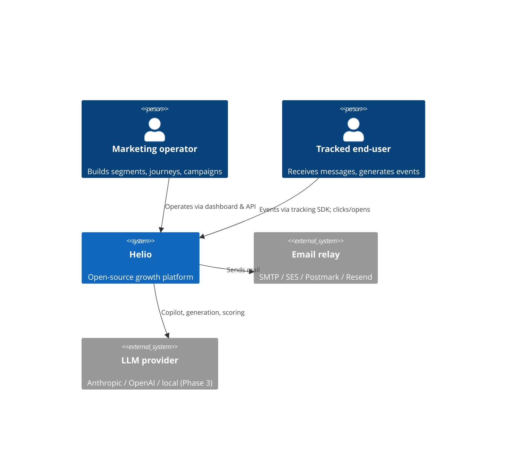
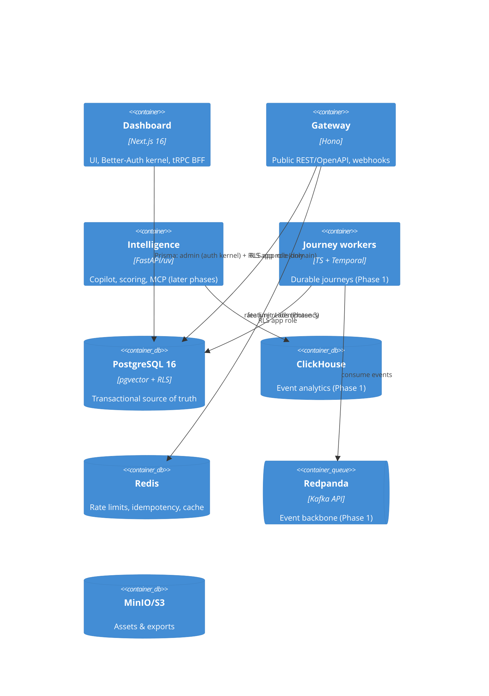

# Architecture

## System context (C4 level 1)

## Containers (C4 level 2)

## Trust boundaries

- **Auth kernel** (inside `apps/web`, admin connection): identity, sessions, memberships. Identity tables are revoked from the app role (ADR-0004).
- **Domain plane** (`helio_app` role, RLS-forced): everything tenant-owned. `forTenant()` is the only path (ADR-0003).
- **Public edge** (`apps/api`): bearer-authenticated, rate-limited, idempotent, problem+json (ADR-0008).

## Where things live

| Concern                                            | Location            |
| -------------------------------------------------- | ------------------- |
| Domain types, env validation, errors, ids, rbac    | `packages/core`     |
| Schema, migrations, tenant client                  | `packages/db`       |
| Design system + Storybook                          | `packages/ui`       |
| Lint/TS/test presets                               | `packages/config`   |
| Dashboard + auth + tRPC                            | `apps/web`          |
| Public REST gateway                                | `apps/api`          |
| Python intelligence plane                          | `apps/intelligence` |
| Compose profiles, Dockerfiles, observability stack | `infra/`            |

Decision log: [`docs/adr/`](./adr/).
