# Subsystem diagrams

Every major Helio subsystem, drawn. Sources live in [`docs/diagrams/*.mmd`](./diagrams/)
(Mermaid) and render to committed SVGs in [`docs/assets/diagrams/`](./assets/diagrams/) via
`task diagrams`. The top-level C4 context and container views are in
[`architecture.md`](./architecture.md).

## Data & ingestion

### Event ingestion → ClickHouse


### CDP identity resolution & merge


### Analytics query pipeline


## Segmentation & journeys

### Segmentation — visual builder → SQL


### Journey execution on Temporal (durable, no double-send)


## Delivery

### Multi-channel delivery adapter layer


### Outbound webhook delivery (HMAC + durable retry)

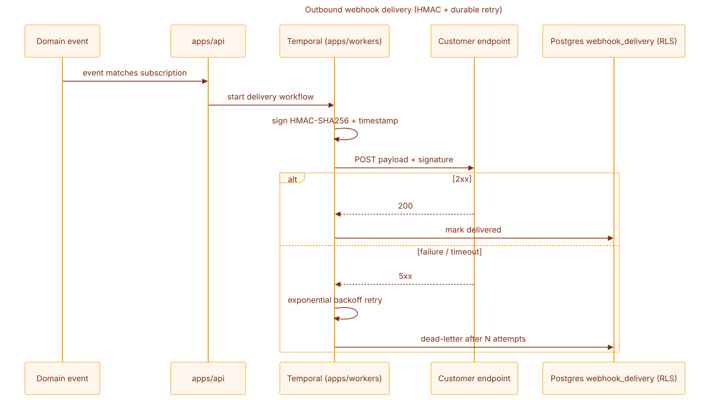

## Capture — pages, forms, widgets

### Landing pages & forms → CDP


### On-site widget embed lifecycle


## AI plane

### Copilot — natural language → segment / journey / content

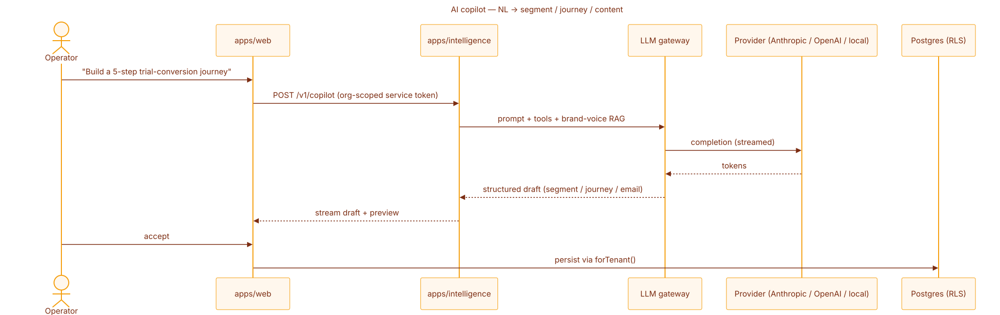

### Predictive scoring / churn


### MCP server — agent-driven campaigns


## Platform & security

### Multi-tenant isolation (Postgres RLS)


### Credential vault (encryption at rest)

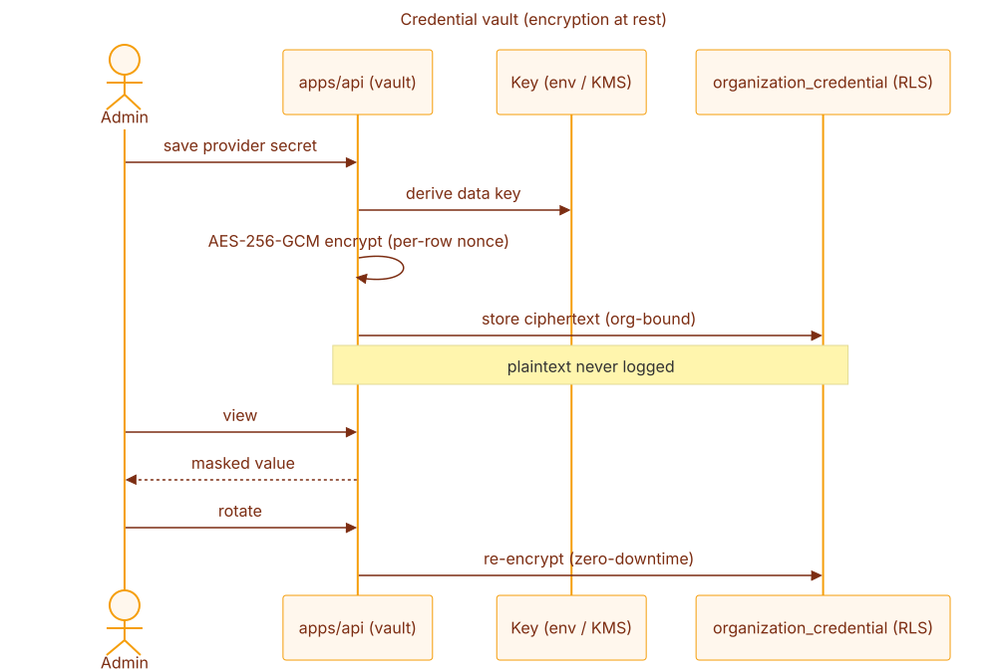

### SSO (OIDC / SAML) + SCIM provisioning

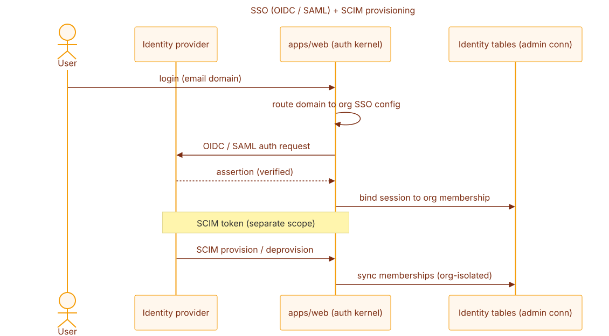

## CRM & operations

### Meeting scheduler


### Deployment profiles (docker compose)

